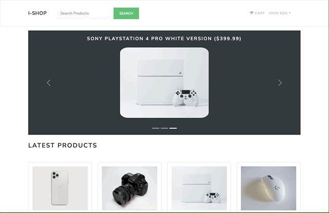

# I-Shop eCommerce Platform

## Preview



## About this project

This is my first time building a fullstack project of this size. I have decided to challenge myself and learn new things along the way. This project is build with the MERN stack. <br />

#### Features

- Full featured shopping cart - All products are listed with a link and price to a product. Remove an item button, a subtotal and a checkout feature, which leads to shipping address and payment. For payment we use Paypal API. With an option to pay with credit or debit. PayPal gives you a fake sandbox account so you can test out the payment process.
- Product reviews and ratings - Your review will be displayed automatically under the product with your name , stars given, date of the review and your comment. The star system will be updated and shown instantly.
- Top products carousel - This is displayed in the Home Screen and will display the top rated products.
- Product pagination - You will have a display of 10 items per page, if you add more items, the buttons for the pages will appear below. Same will apply for the Admin screens for the orders and users.
- Product search feature - You can type a letter or a full name of the product and you'll be able to view it in a new screen. If that item does not exist, you'll see an empty page and button to go back.
- User profile with orders - A registered user has a profile page with all the orders and the ability to change the name , email and password.
- Admin product management - This is where you can create, remove & edit your products,
- Admin user management - You can make another user admin, remove or edit their info (except for the password)
- Admin Order details page - In this page you can see all the orders made, paid/unpaid. When you click on details of the order, you can see all the info related to that order and change the order to delivered.
- Database seeder (products & users)
  <br />
  It’s clear that state management gets messy as the app gets complex. This is why you need a state management tool like Redux that makes it easier to maintain these states. I've linked some resources below if it's also your first time with Redux.

## Usage

### ES Modules in Node

We use ECMAScript Modules in the backend in this project. Be sure to have at least Node v14.6+ or you will need to add the "--experimental-modules" flag.

Also, when importing a file (not a package), be sure to add .js at the end or you will get a "module not found" error

### Env Variables

Create a .env file in then root and add the following

```
NODE_ENV = development
PORT = 5000
MONGO_URI = your mongodb uri
JWT_SECRET = 'abc123'
PAYPAL_CLIENT_ID = your paypal client id
```

### Install Dependencies (frontend & backend)

```
npm install
cd frontend
npm install
```

### Run

```
# Run frontend (:3000) & backend (:5000)
npm run dev

# Run backend only
npm run server
```

## Build & Deploy

```
# Create frontend prod build
cd frontend
npm run build

```

There is a Heroku postbuild script, so if you push to Heroku, no need to build manually for deployment to Heroku

### Seed Database

You can use the following commands to seed the database with some sample users and products as well as destroy all data

```
# Import data
npm run data:import

# Destroy data
npm run data:destroy
```

```
Sample User Logins

admin@example.com (Admin)
123456

john@example.com (Customer)
123456

Jane@example.com (Customer)
123456
```

### Realated links to tools and methods used

#### UI/Frontend

- [Create your favicon](https://favicon.io)
- [React-Redux](https://react-redux.js.org)
- [Why React-Redux?](https://www.jobsity.com/blog/why-and-when-you-should-use-redux)
- [Redux DevTools](https://chrome.google.com/webstore/detail/redux-devtools/lmhkpmbekcpmknklioeibfkpmmfibljd?hl=en)- chrome extension to see your state change
- [Create React app](https://reactjs.org/docs/create-a-new-react-app.html) - With a command 'npx create-react-app frontend', will generate your react your initial react files in your frontend folder.
- [React Bootstrap](https://react-bootstrap.github.io)
- [Free Bootstrap Themes](https://bootswatch.com) - simply download the css file and place it in you src folder & import it to your index.js file. -[ Font-Awesome cdn](https://cdnjs.com/libraries/font-awesome) - for your icons
- [React Helmet](https://www.npmjs.com/package/react-helmet)
- [Paypal button](react-paypal-button-v2)

#### Backend

- [Postman - http client to test out routes](https://www.postman.com)
- [Express](https://expressjs.com)
- [Axios](https://axios-http.com/docs/intro)
- [Nodemon](https://www.npmjs.com/package/nodemon)
- [Concurrently](https://www.npmjs.com/package/concurrently)
- [dotenv](https://www.npmjs.com/package/dotenv)
- [express-async-handler](https://www.npmjs.com/package/express-async-handler)
- [jsonwebtoken](https://www.npmjs.com/package/jsonwebtoken)
- [morgan](https://www.npmjs.com/package/morgan)
- [multer](https://www.npmjs.com/package/multer)

#### Database

- [MongoDB - NoSQL database](https://www.mongodb.com)
- [mongoose](https://mongoosejs.com)
- [bcryptjs](https://www.npmjs.com/package/bcryptjs)

#### Dependencies

##### Frontend

- react
- react-dom
- react-scripts
- react-bootstrap
- react-router-dom
- react-router-boostrap
- redux
- react-redux
- redux-thunk (in our action creators, allows us to make async requests, to talk to our server from those action creators)
- redux-devtools-extension
- react-helmet - document head manager for react
- react-paypal-button-v2

##### Backend

- express - Express. js is a Node. js web application server framework, designed for building single-page, multi-page, and hybrid web applications. It is the de facto standard server framework for node.
- axios - Axios is a library that serves to create HTTP requests that are present externally.
- nodemon (dev-dependency) - nodemon is a tool that helps develop node. js based applications by automatically restarting the node application when file changes in the directory are detected.
- concurrently (dev-dependency) - an npm package that allows you to run multiple commands concurrently aka run frontend and backend servers.
- dotenv - DotEnv is a lightweight npm package that automatically loads environment variables from a . env file into the process.
- express-async-handler - Simple middleware for handling exceptions inside of async express routes and passing them to your express error handlers.
- jsonwebtoken - is an open standard used to share security information between two parties — a client and a server.
- morgan - morgan is a Node. js and Express middleware to log HTTP requests and errors, and simplifies the process.
- multer - Multer is a node. js middleware for handling multipart/form-data , which is primarily used for uploading files.

##### Database

- mongoose - It manages relationships between data, provides schema validation, and is used to translate between objects in code and the representation of those objects in MongoDB.
- bcryptjs -Using bcrypt is a secured way to store passwords in my database regardless of whatever language my app's backend is built in.

#### Optional- VS-Code extentions

- ES7 React/Redux/GraphQl/React-Native snippets - helps generate React components (rafce- react arrow funtion compmonent export)
- Bracket Pait Colorizer
- Auto Rename Tag
- JavaScript ES code snippets
- Prettier- Code formatter

#### [A little about Redux Pattern](https://www.dotnetcurry.com/reactjs/1356/redux-pattern-tutorial)

You have two kinds of states. Component level state and Global state/Application state. A component state has to do with a specific component(Header, Footer etc). A global state has to do with application, so something like Products, because with products youd want to use in multiple components, access, edit, add products & delete. So you want them to be available to all of your components. You can put all your state in App.js file and just pass pieces of state up and down through props, but that gets messy and you dont want to do it with an application of this size. <br />
Some other things youd have in your global state is the authenticated user(when we log in, we want to access to that users data, that would be held in the state), cart items, orders. <br />
So the way the state is changed is through reducers or reducer functions. These functions accept actions and they're responsible for manipulating and passing the state down to components. Actions are just objects that represent the intention to change a piece of state. We also have action creators which are functions that will dispatch or fire off those actions. <br />
Ex: We have an action creator function getProducts and in that action creator we make a fetch request to the backend to get data using axios or fetch api, and we get that data back and we dispatch an action to the reducer and we attach a payload to it. And that payload will have the fetched data. In the reducer we can assign that payload data to the state and we can pass it to any components that ask for it. So we can have multiple components that ask for the same piece of state. <br />
Anyways, this is the easiest way that someone can explain it, as its easier to show in practice.
<br />
Redux isnt part of React, or for the React, but it it commonly used with React. And the way you have them work together is with the react-redux package.

## License

```
MIT License

Copyright (c) 2021 Shay Asanova

Permission is hereby granted, free of charge, to any person obtaining a copy
of this software and associated documentation files (the "Software"), to deal
in the Software without restriction, including without limitation the rights
to use, copy, modify, merge, publish, distribute, sublicense, and/or sell
copies of the Software, and to permit persons to whom the Software is
furnished to do so, subject to the following conditions:

The above copyright notice and this permission notice shall be included in all
copies or substantial portions of the Software.

THE SOFTWARE IS PROVIDED "AS IS", WITHOUT WARRANTY OF ANY KIND, EXPRESS OR
IMPLIED, INCLUDING BUT NOT LIMITED TO THE WARRANTIES OF MERCHANTABILITY,
FITNESS FOR A PARTICULAR PURPOSE AND NONINFRINGEMENT. IN NO EVENT SHALL THE
AUTHORS OR COPYRIGHT HOLDERS BE LIABLE FOR ANY CLAIM, DAMAGES OR OTHER
LIABILITY, WHETHER IN AN ACTION OF CONTRACT, TORT OR OTHERWISE, ARISING FROM,
OUT OF OR IN CONNECTION WITH THE SOFTWARE OR THE USE OR OTHER DEALINGS IN THE
SOFTWARE.
```

## Contact

shay[dot]asanova[at]gmail[dot]com
